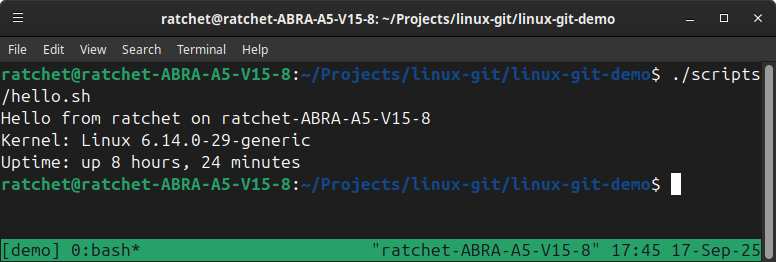

# Linux + Git (Core) — Proof Pack

**Goal:** Prove baseline Linux + Git fluency (SSH, branches, PRs) and tmux use.

## What’s included
- `scripts/hello.sh` — simple system info script
- `.gitignore` — ignores common noise
- `images/tmux-demo.png` — tmux run screenshot
- This README

## How to run tmux demo
```bash
tmux new -s dev         # start a tmux session (Ctrl-b then d to detach)
./scripts/hello.sh      # run the demo
```


# Git workflow used

* Feature branch created with `git switch -c`

* Commit locally with `git commit`

* Publish branch with `git push -u origin <branch>`

* Open PR (GitHub UI or `gh pr create`) and merge

# Artifacts

Closed PRs: [#5](https://github.com/CanGitArchive/linux-git-demo/pull/5), [#6](https://github.com/CanGitArchive/linux-git-demo/pull/6)

Screenshot:


