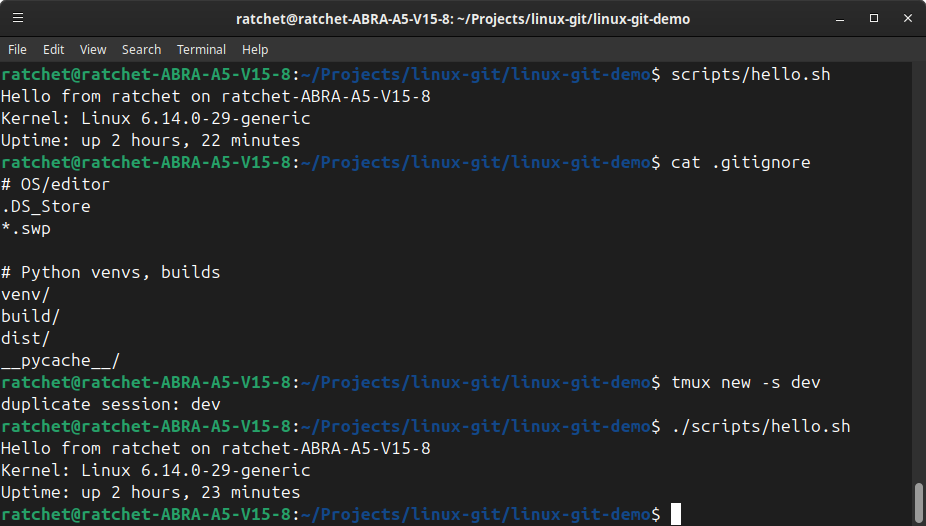

# Linux + Git (Core) — Module 1

Baseline Linux + Git fluency: dotfiles, tmux use, SSH to GitHub, clean branching & PR.

## What’s included (proof)
- `~/.tmux.conf` (mouse, history, vi-keys)
- `scripts/hello.sh` (simple system info demo)
- `.gitignore`
- This README

## How to run
```bash
tmux new -s dev         # start a session (Ctrl-b d to detach)
./scripts/hello.sh      # run the demo

Feature branch: 01-linux-setup
PR -> squash & merge to main



